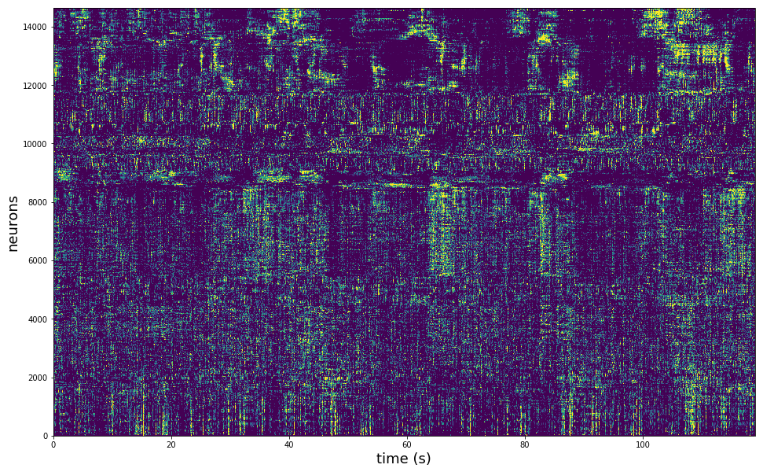

# rastermap

This algorithm computes a 2D continuous sorting of neural activity. It assumes that the spike matrix `S` is neurons by timepoints. We have a python 3 and a matlab implementation.

Here is what the output looks like for a segment of a mesoscope recording (2.5Hz sampling rate) (sorted in neural space, but not time space):


Here's an example of multi-probe Neuropixels recording from visual cortical areas:



Here is an example using the algorithm (also see this [jupyter-notebook](rastermap/run_rastermap.ipynb))

```
from rastermap import mapping # <-- if pip installed
import numpy as np
from scipy.ndimage import gaussian_filter1d
import matplotlib.pyplot as plt

# load data (S is neurons x time)
# these files are the outputs of suite2p
S = np.load('spks.npy')
iscell = np.load('iscell.npy')
S = S[iscell[:,0].astype(bool),:]

# run rastermap 
# (will take ~ 30s for 6000 neurons x 20000 timepts on a laptop)
# these are the default options, you can change them and input them to the function
ops = {'nclust': 30, # number of clusters
       'iPC': np.arange(0,200).astype(np.int32), # number of PCs to use for mapping algorithm
       'upsamp': 100, # upsampling factor for embedding position
       'sigUp': 1, # standard deviation for kriging upsampling
       'equal': False # whether or not clusters should be of equal size (recommended False!)
       }
# user options
isort1,isort2 = mapping.main(S,ops)

# if you just want to use the defaults
isort1,isort2 = mapping.main(S)

# sort neurons and smooth across neurons and zscore in time
# smoothing will take ~ 10s depending on data size
Sm = gaussian_filter1d(S[isort1,:].T, np.minimum(10,int(S.shape[0]*0.005)), axis=1)
Sm = Sm.T
Sm = zscore(Sm, axis=1)

# (optional) smooth in time
Sm = gaussian_filter1d(Sm, 1, axis=1)

# view neuron sorting :)
fs = 2.5 # sampling rate of data in Hz
sp = Sm[:,1000:3000]
plt.figure(figsize=(16,12))
ax=plt.imshow(sp,vmin=0,vmax=3,aspect='auto',extent=[0,sp.shape[1]/fs, 0,sp.shape[0]])
plt.xlabel('time (s)', fontsize=18)
plt.ylabel('neurons', fontsize=18)
plt.show()

```

If you don't pip install the package, you can also run it using the path to your local github folder
```
import sys
sys.path.insert(0, '/media/carsen/DATA2/github/rastermap/rastermap/')
import mapping
```

### Installation

You can just download the github folder as outlined above or you can pip install the package:
```
pip install rastermap
```

### Requirements

This package was written for Python 3 and relies on **numpy** and **scipy**. The Python3.x Anaconda distributions will contain all the dependencies.

### Matlab

The matlab code needs to be cleaned up but the main function to call is `mapTmap.m`. This function is used in the example script `loadFromPython.m` (loads suite2p outputs, requires [npy-matlab](https://github.com/kwikteam/npy-matlab))

